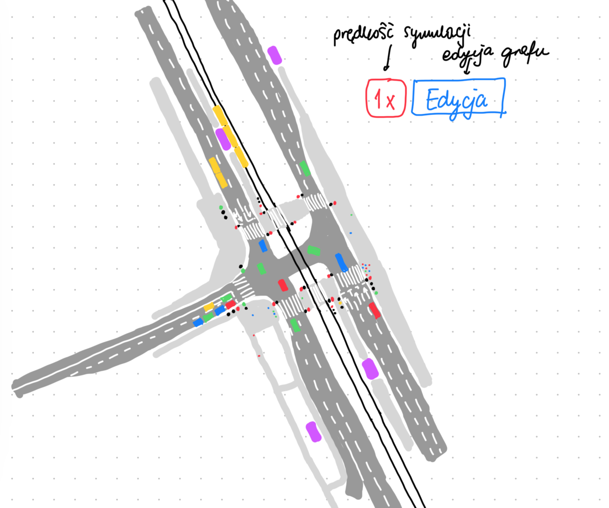
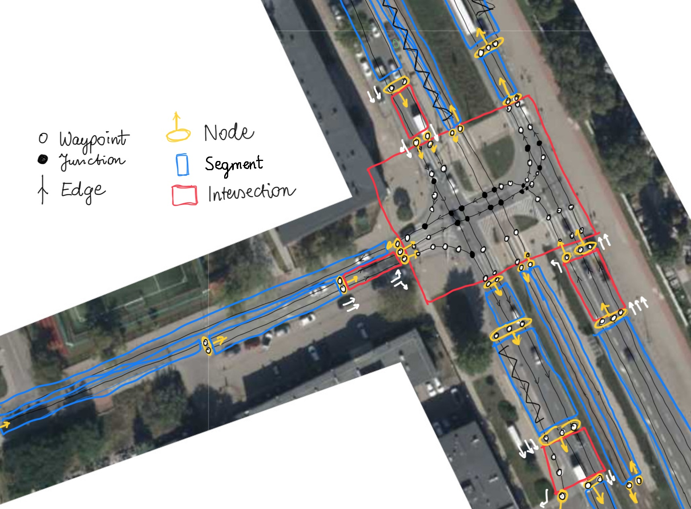

# Symulacja ruchu drogowego
Przedmiotem mojego projektu jest stworzenie mikro-symulacji ruchu drogowego. Zakresem symulacji jest realistyczne przestawienie ruchu na małym obszarze (maksymalnie kilka skrzyżowań w jednej sytuacji). 

## Założenia techniczne:
- Środowisko: Visual Studio (MSVC)  
- Repozytorium: Github  
- UI, grafika: Raylib  

## Dostępne czynności
Funkcjonalności:
- Sterowanie prędkością oraz zatrzymania symulacji
- Zmiana wybranych parametrów symulacji przez użytkownika
- Honorowanie pierwszeństwa zgodnie z zasadami ruchu drogowego,  
- Różny czas reakcji, przyspieszenie, zachowanie kierowców/agentów,   
- Generowanie agentów w wyznaczonym przez użytkownika charakterze w danym miejscu / na danym wlocie skrzyżowania,  
- Wyszukiwanie optymalnej ścieżki do celu przez agenta,  
    - Możliwość zmiany pasów/ścieżki w celu ominięcia zatoru,  
- Automatyczne rysowanie w miarę sensownych oznaczeń poziomych na drodze - np. linia warunkowego zatrzymania, linia przerywana,

.
- Wgranie predefiniowanego skrzyżowania 
- Celem optymalizacji obsługa wszystkich `Vertex` i `Node` przez quadtree,
- Ruch pieszych oraz rowerzystów,
- Kompleksowa sygnalizacja świetlna wraz z:
    - Programami sygnalizacji świetlnej z możliwością ich regulacji,
    - Automatyczne wyliczanie czasów międzyzielonych potrzebne do zapewnienia bezpiecznej pracy sygnalizacji świetlnej
    - Algorytmy sygnalizacji świetlnej i detektory pojazdów. 
- Pojazdy komunikacji miejskiej (tramwaj, autobus) przewożące pasażerów (generujące agentów typu pieszy na wyznaczonym przystanku, którzy korzystają ze skrzyżowania)
- Wizualizacja danych, statystyki, diagramy przepływu ruchu

## UI

## Struktura programu

Symulacja składa się z dwóch głównych części:
- Obsługa infrastruktury 
- Obsługa agentów (uczestników ruchu drogowego)  

Dodatkowo od logiki zostanie oddzielona obsługa wejść (klawiszy, myszy).

### Obsługa infrastruktury:
Droga, po której będą poruszać się agenci będzie reprezentowana jako graf, który składa się z krawędzi i wierzchołków. W celu dostatecznie kompleksowej obsługi agentów graf, dzielę na dwa poziomy:

**Na niskim poziomie graf będzie składał się z wierzchołków `Vertex` i krawędzi `Edge`.**
- Pojedyńczy `Vertex` przedstawia punkt w przestrzeni 2D,
- Każdy `Edge` reprezentuje połączenie między dwoma `Vertex` w linii prostej,
- Tworząc nowy `Edge`, który przecinałby już istniejący `Edge` dzielimy, przecinające się `Edge`, a w ich punkcie przecięcia dodajemy `Vertex`,
- Celem udogodnień w obsłudze wyszukiwania ścieżki, sprawdzania kolizji / pierwszeństwa w głąb grafu `Vertex` może być:
    - typu `Waypoint`: max 1 `Edge` wchodzący i max 1 `Edge` wychodzący,
    - typu `Junction`: >1 `Edge` wchodzący lub >1 `Edge` wychodzący.

**Na wysokim poziomie będzie się składać z wierzchołków `Node` i krawędzi `Segment`**:

- `Node` to zbiór `Vertex` z pewnym punktem odniesienia oraz z kierunkiem,
- `Link` to zbiór `Edge` łączących `Node`.  

`Link` dzielę na 2 przypadki:
   - Łączy 2 `Node` to jest segmentem typu `Segment`,    
   - Łączy >2 `Node` to jest segmentem typu `Intersection`.  

### Obsługa agentów:
Agenci są generowani w wyznaczonym miejscu z daną częstotliwością i losowością. Agenci mają docelowy `Node` do którego zmierzają. 
Agenci dzielą się na `Vehicle`, `Pedestrian`, `Cyclist`. `Vehicle` dalej dzielą się na `Car`, `MassTransit`, a `MassTransit` na `Bus` i `Tram`. Pojazdy celem trzymania się zasad ruchu drogowego wykorzystują graf przeszukując możliwe kolizje w nadchodzących `Junction` z innymi pojazdami, które mają pierwszeństwo.  
